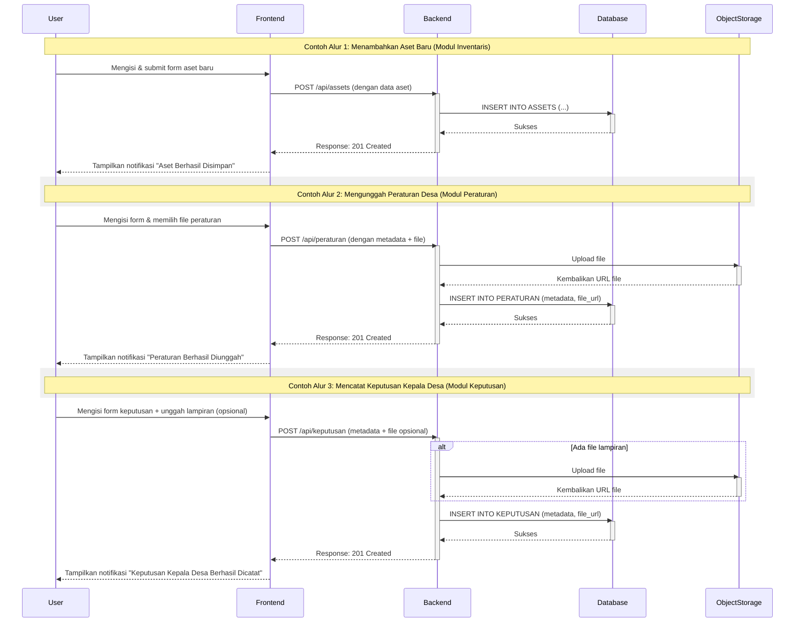

# Village Administration Website

Website terbaik untuk mata kuliah Projek Rekayasa Perangkat Lunak (PRPL) di Universitas Gadjah Mada.

Sebelum mulai, **wajib** baca panduan development [di sini](./docs/development.md).

## 🚀 Modules

- Inventaris dan Kekayaan (Kelompok 2)
- Peraturan Desa (Kelompok 7)
- Keputusan Kepala Desa (Kelompok 8)

## 🛠️ Tech Stack

- NextJS 15 (Typescript)
- Tailwind
- shadcn/ui
- Better Auth
- Drizzle ORM
- PostgreSQL 16

## 📝 Commit Convention

We follow a [standardized commit message](https://conventionalcommits.org) format to maintain a clean and informative git history. Each commit message should be structured as follows:

```
<type>(<scope>): <subject>
```

### Types:

-   **feat**: A new feature
-   **fix**: A bug fix
-   **build**: Changes to libraries, etc
-   **docs**: Documentation changes
-   **refactor**: Code changes that neither fix a bug nor add a feature
-   **perf**: Changes that improve performance
-   **test**: Adding or updating tests
-   **chore**: Changes to build process, auxiliary tools, or libraries

### Scope:

The scope is optional and can be anything specifying the place of the commit change (component, page, or file name).

### Subject:

The subject contains a brief description of the change:

-   Use the imperative, present tense: "change" not "changed" nor "changes"
-   Don't capitalize the first letter
-   No period (.) at the end

## ⚡ User Flow



## 👥 Contributors

<a href="https://github.com/sultandevin/desa/graphs/contributors">
  
</a>
