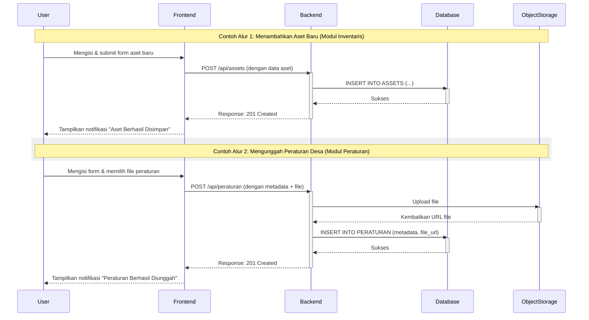

# Village Administration Website

Website terbaik untuk mata kuliah Projek Rekayasa Perangkat Lunak (PRPL) di Universitas Gadjah Mada.

Sebelum mulai, baca panduan development [di sini](./docs/development.md).

## 🚀 Modules

- Inventaris dan Kekayaan (Kelompok 2)
- Peraturan Desa (Kelompok 7)
- Keputusan Kepala Desa (Kelompok 8)

## 🛠️ Tech Stack

- NextJS 15 (Typescript)
- Tailwind
- shadcn/ui
- Better Auth
- Drizzle ORM
- PostgreSQL 16

## ⚡ User Flow

## 👥 Contributors

